# laravel-laradock-phpstorm
forked from LarryEitel/laravel-laradock-phpstorm

updated to include laravel 5.7

Wiring up [Laravel](https://laravel.com/), [LaraDock](https://github.com/LaraDock/laradock) [Laravel+Docker] and [PHPStorm](https://www.jetbrains.com/phpstorm/) to play nice together complete with remote xdebug'ing as icing on top!


- [Intro](#Intro)
- [Installation](#Installation)
    - [Windows](#InstallWindows) 
    - [Mac](#InstallMac)
    - [Docker](#InstallDocker) 
    - [Laravel](#InstallLaravel) 
    - [LaraDock](#InstallLaraDock) 
        - [Customized workspace](#CustomizeWorkspace) 
        - [Customized laradock/docker-compose.yml](#CustomizeDockerCompose) 
        - [Clean House](#InstallCleanHouse) 
        - [LaraDock Dial Tone](#InstallLaraDockDialTone) 
        - [SSH into php-fpm](#InstallLaraDockSSH) 
            - [KiTTY](#InstallKiTTY) 
    - [PHPStorm](#InstallPHPStorm)
        - [Configs](#InstallPHPStormConfigs)
- [Usage](#Usage)
    - [Laravel](#UsageLaravel) 
        - [Run ExampleTest](#UsagePHPStormRunExampleTest) 
        - [Debug ExampleTest](#UsagePHPStormDebugExampleTest) 
        - [Debug Web Site](#UsagePHPStormDebugSite) 

<a name="Intro"></a>
## Intro
Goal is to put together a sample Laravel project running on LaraDock that can run in a development environment complete with remote debugging. 

This project is tested on Docker Native Windows and mac OSX.
(INFO) Docker on mac will only work with cpus that support hyper-v. at this time we have not gotten laradock to work with virual toolbox.

<a name="Installation"></a>
## Installation
This project assumes experience and familiarity with Laravel, LaraDock and PHPStorm before proceeding. 
The purpose of this project is to focus on how to get these three projects to work together in a PHPStorm development workflow.


<a name="InstallWindows"></a>
### Windows
#### [Hosts File Editor](https://github.com/scottlerch/HostsFileEditor)
    - Hosts File Editor makes it easy to change your hosts file as well as archive multiple versions for easy retrieval.
    - Set `laravel` to your docker host IP. See [Example](screenshots/SimpleHostsEditor/AddHost_dockerhost.png).

<a name="InstallMac"></a>
### Mac
    - Hosts File on the mac can be edited as follows.
    - sudo nano /etc/hosts
    
<a name="InstallDocker"></a>
### Docker


<a name="InstallLaravel"></a>
### Laravel

Install Laravel somewhere. See from perspective of [LaraDock Installation](https://github.com/LaraDock/laradock#Installation).

- Example with [Laravel Installer](https://laravel.com/docs/5.2#installing-laravel)
`laravel new laravel-laradock-phpstorm` or
 composer create-project laravel/laravel ((name-of-your-prjject)) example:composer create-project laravel/laravel blog
 
#### Create a GIT repo
- [Create a new repository](https://github.com/new)
```
cd ((name-of-your-prjject))
git init
git add .
git  commit -m "first commit"
git remote add origin git@github.com:((git user))/((name-of-your-project)).git
      example git remote add origin git@github.com:brazitech/blog.git
push -u origin master
```

<a name="InstallLaraDock"></a>
### Laradock
Since we will be using LaraDock as a submodule,
```
# /c/_dk/laravel-laradock-phpstorm
git submodule add https://github.com/LaraDock/laradock.git
cd laradock

Since we will be hacking a bit on this, need to preserve refactoring with parent repo. So I will remote .git.
rm -rf .git*

```

<a name="CustomizeWorkspace"></a>
#### Customize workspace
The LaraDock workspace container is based on [phusion/baseimage-docker](https://github.com/phusion/baseimage-docker).
This image provides support out of the box for `SSH` although it is not enabled by default.

#### Note regarding xdebug
Although xdebug is installed, it is not switched on by default. This is so that tools like `composer` will not be slowed down.
PHPStorm is configured to enable `xdebug` on-demand when running unit tests. See [PHPStorm Intepreters](https://github.com/LarryEitel/laravel-laradock-phpstorm/blob/master/screenshots/PHPStorm/Settings/LangsPHPInterpreters.png) example.

### Edited laradock/docker-compose.yml

#### Workspace Utilities Container
- Set: INSTALL_XDEBUG=true

#### PHP-FPM Container
- Set: INSTALL_XDEBUG=true
    - Note: xdebug is installed but disabled until switched on. See: [Debug Web Site](#UsagePHPStormDebugSite)

NOTE: PHP_IDE_CONFIG="serverName=[laravel](https://github.com/brazitech/laravel-laradock-phpstorm/blob/master/screenshots/PHPStorm/Settings/DeploymentConnection.png)" must point to a valid `Build, Execution, Deployment > Deployment > Name`.


- If your containers are currently running, let's give it a restart.
`docker-compose up -d mysql nginx`


<a name="InstallCleanHouse"></a>
### Need to clean house first?
Make sure you are starting with a clean state. For example, do you have other LaraDock containers and images?
Here are a few things I use to clean things up.

- Delete all containers using `grep laradock_` on the names, see: [Remove all containers based on docker image name](https://linuxconfig.org/remove-all-containners-based-on-docker-image-name). 
`docker ps -a | awk '{ print $1,$2 }' | grep laradock_ | awk '{print $1}' | xargs -I {} docker rm {}`

- Delete all images containing `laradock`.
`docker images | awk '{print $1,$2,$3}' | grep laradock_ | awk '{print $3}' | xargs -I {} docker rmi {}`
**Note:** This will only delete images that were built with `LaraDock`, **NOT** `laradock/*` which are pulled down by `LaraDock` such as `laradock/workspace`, etc.
**Note:** Some may fail with: 
`Error response from daemon: conflict: unable to delete 3f38eaed93df (cannot be forced) - image has dependent child images`

- I added this to my `.bashrc` to remove orphaned images.
    ```
    dclean() {
        processes=`docker ps -q -f status=exited`
        if [ -n "$processes" ]; thend
          docker rm $processes
        fi
    
        images=`docker images -q -f dangling=true`
        if [ -n "$images" ]; then
          docker rmi $images
        fi
    }
    ```

<a name="InstallLaraDockDialTone"></a>
#### Let's get a dial-tone with Laravel

```
# barebones at this point
docker-compose up -d nginx mysql

# run 
docker-compose ps

# Should see:
          Name                        Command             State                     Ports
-----------------------------------------------------------------------------------------------------------
laradock_mysql_1            docker-entrypoint.sh mysqld   Up       0.0.0.0:3306->3306/tcp
laradock_nginx_1            nginx                         Up       0.0.0.0:443->443/tcp, 0.0.0.0:80->80/tcp
laradock_php-fpm_1          php-fpm                       Up       9000/tcp
laradock_volumes_data_1     true                          Exit 0
laradock_volumes_source_1   true                          Exit 0
laradock_workspace_1        /sbin/my_init                 Up       0.0.0.0:22->22/tcp


```

<a name="InstallLaraDockSSH"></a>
#### Let's shell into workspace
Assuming that you are in laradock folder.
`ssh -i workspace/insecure_id_rsa root@laravel`

<a name="InstallKiTTY"></a>
**Cha Ching!!!!**
##### KiTTY
[Kitty](http://www.9bis.net/kitty/) KiTTY is a fork from version 0.67 of PuTTY.

- Here are some settings that are working for me:
    - 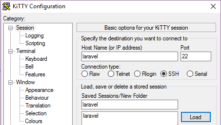
    - 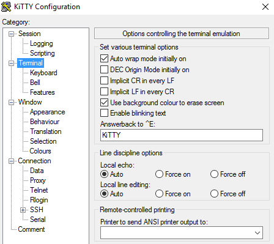
    - 
    - 
    - 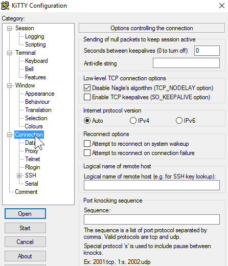
    - 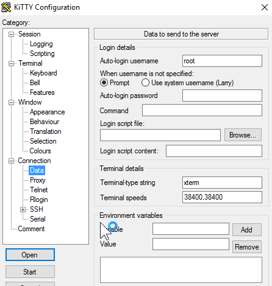
    - 
    - 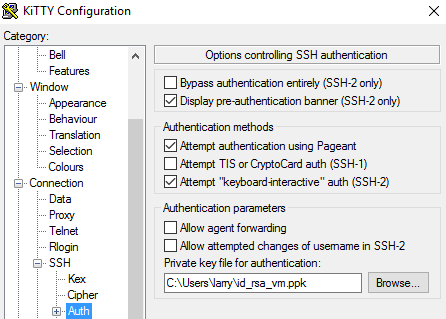


<a name="InstallPHPStorm"></a>
### PHPStorm
- File/New Project

`dockerhost` was added to `etc/hosts` and points to `Docker Host IP`.


    - 
Yes

<a name="InstallPHPStormConfigs"></a>
#### Configs
- Here are some settings that work:
    - `Settings/BuildDeploymentConnectionMappings`
        - 
    
    - `Settings/DeploymentConnection`
        - 
    
    - `Settings/DeploymentMappings`
        - 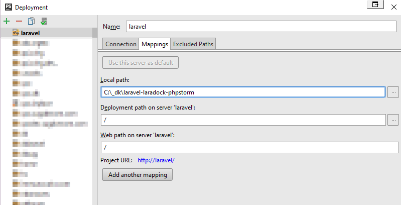
    
    - `Settings/LangsPHPInterpreters`
        - 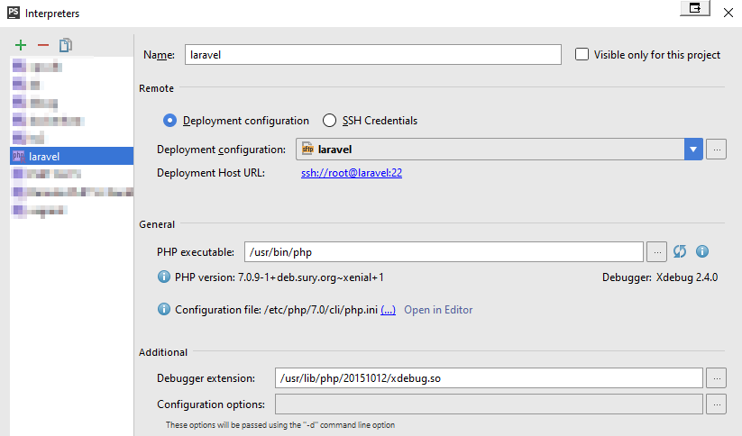
    
    - `Settings/LangsPHPPHPUnit`
        - 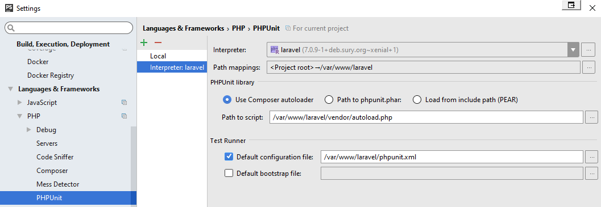
    
    - `Settings/EditRunConfigurations`
        - 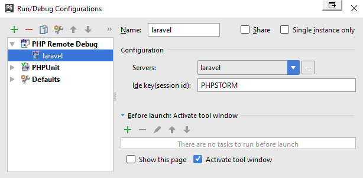
    
    - `Settings/LangsPHPServers`
        - 
    
    - `RemoteHost`
        To switch on this view, go to: `Menu/Tools/Deployment/Browse Remote Host`.
        - 


<a name="Usage"></a>
## Usage

<a name="UsagePHPStorm"></a>
## PHPStorm
<a name="UsagePHPStormRunExampleTest"></a>
### Run ExampleTest
- right-click on `tests/ExampleTest.php`
    - Select: `Run 'ExampleTest.php'` or `Ctrl+Shift+F10`.
    - Should pass!! You just ran a remote test via SSH!

<a name="UsagePHPStormDebugExampleTest"></a>
### Debug ExampleTest
- Open to edit: `tests/ExampleTest.php`
- Add a BreakPoint on line 16: `$this->visit('/')`
- right-click on `tests/ExampleTest.php`
    - Select: `Debug 'ExampleTest.php'`.
    - Should have stopped at the BreakPoint!! You are now debugging locally against a remote Laravel project via SSH!
    - 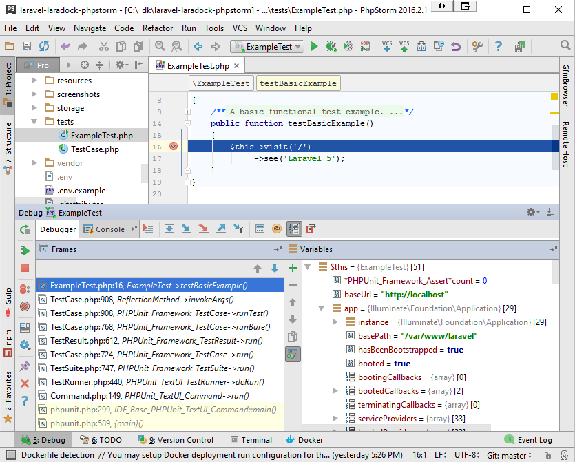


<a name="UsagePHPStormDebugSite"></a>
### Debug WebSite
- In case xDebug is disabled, from the `laradock` folder run: 
`./xdebugPhpFpm start`.
    - To switch xdebug off, run: 
`./xdebugPhpFpm stop`
    
- Start Remote Debugging
    -  
- Open to edit: `bootstrap/app.php`
- Add a BreakPoint on line 14: `$app = new Illuminate\Foundation\Application(`
- Reload [Laravel Site](http://laravel/)
    - Should have stopped at the BreakPoint!! You are now debugging locally against a remote Laravel project via SSH!
    - 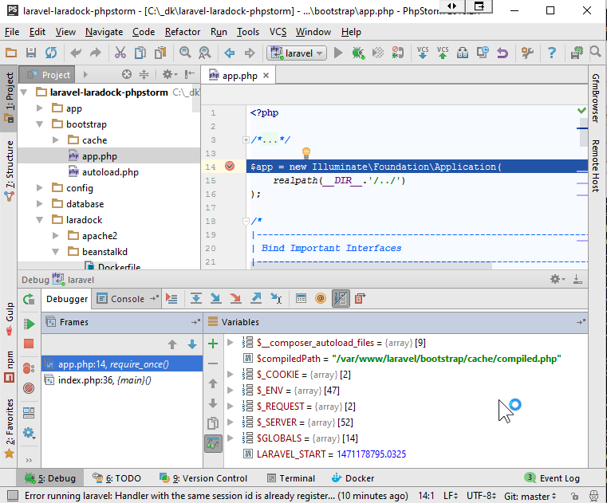
